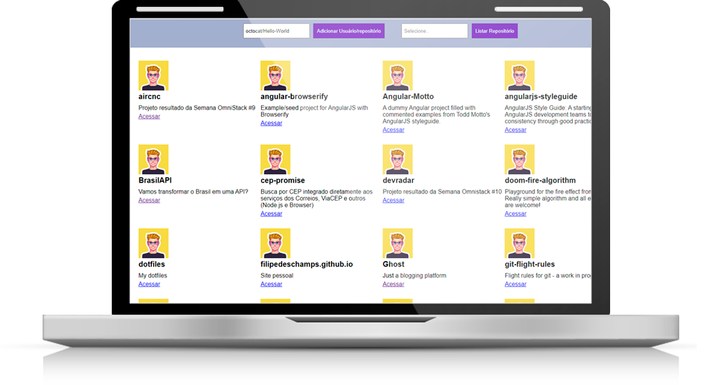

<h1 align="center">ES6+ Github Repository list view :sunny:</h1>

<p align="center">
  
</p>

### HOW CAN YOU USE IT:
- Clone this repository: `git clone "this-repository-url"`

## Install
Enter to individual folder and:

```sh
npm install
```


## Usage
Enter to individual folder and:

```sh
npm run build or npm run dev
```

```sh
or just open index.html from public folder in a web browser
```

## 💻 About the Project
- A simple ES6+ frontend to connect Github api and list repositories of a user (configured to list until 200 repositories).

 ## 💻 Technologies

 - JavaScript ES6+ with: Babel / Webpack


## :memo: License

This project is under the MIT license. For more details visit: [LICENSE](.github/LICENSE.md).
